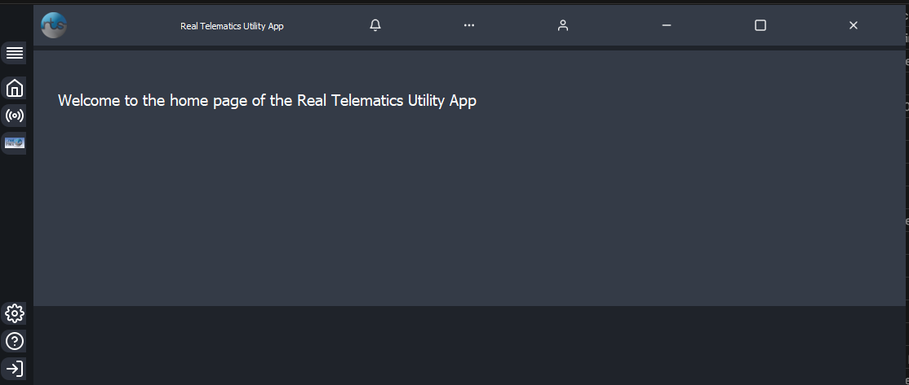
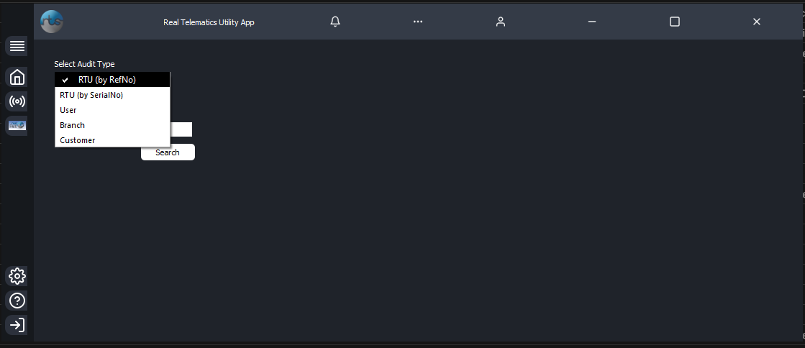
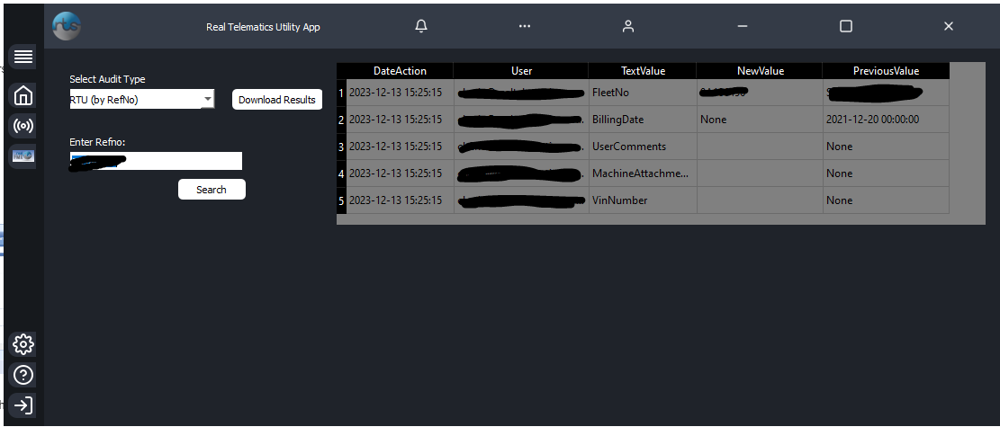

# RTSUtilityApp

This was a shot that I made at solving real world problems at the company I work for. I am able to expose a lot of the code publically without exposing any company data. I plan on continuing to update and improve the app.

# RTSUtility App:

This app just combines a bunch of ad hoc support tasks into easy button clicks.

# Realcontrol Section:

### Audits Page:

This page automates some of the auditing requests we get. Currently it supports:  
RTU By Refno  
RTU By SerialNo  
User  
Branch  
Customer

This pulls all results for the target from the Core DB, and then compares each row to the previous values. Any changes in noteworthy columns are appended to the results table.

### Update Historical (by Refno):

This section just runs a stored proc against a Refno to update previous DB records to the current refno. All of the logic to do this is contained in the stored proc. Note: you use the NEW Refno to run the proc.

### Check/Add Default Machine Branch:

There is an old bug in Realcontrol where if a Branch lacks a Default Machine, it will disappear from mapping menus (for customers, machines, etc). This will cause the customer to not appear as well. The call usually sounds something like "I can find the branch under admin>edit>branch, but when I try map xy machine to it, I can't find it". If you suspect a default machine is missing, this tool will check. If it finds no default machine, it will show a button that will allow you to add one. The script is pulled straight from how its done within the app.

# Qsmacker Section:

### Qsmacker Permissions Update:

There has never been a method within Realcontrol to give user permissions to the Qsmacker app. This will check if user permissions exist, and if they don't, allow you to add them. If ANY permissions exist, it will not allow any updates (better to do it manually if that's the case). The method in the DB is not the greatest- we copy from a current userID and select them into the table with the new User's ID.

### Check Qsmacker Batch Status:

This was a need at one point due to poor performance of Qsmacker and the FMX Driver. It also gives us a big, red, "STOP THE JOB" button that we've always needed. Most of the queries here were recycled from the manual troubleshooting days.

Random Notes:

Fix for C:\Python311\Lib\site-packages\Custom_Widgets\QCustomSlideMenu:  
There was an error with the type being passed to the floatMenu() method. I changed it from regular division (/) to floor division (//)
